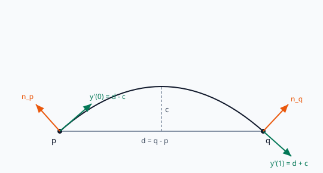
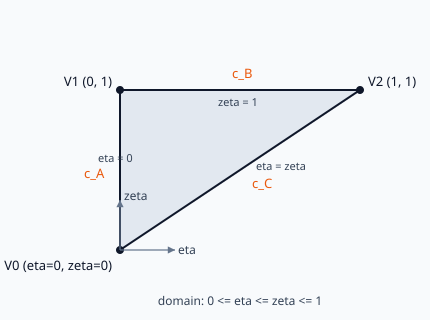
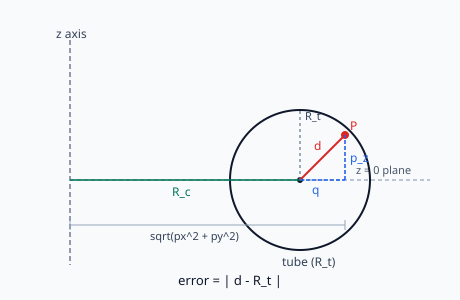

# C0 Nagata Patch — Derivation and Implementation Notes
> Transcribed and cleaned up from my handwritten notes while building this evaluator.

Notes behind the C0 Nagata patch evaluator in this repository: the motivation,
the full derivation of the patch coefficients from first principles, the
verification tests, the error metrics, and the findings and limitations from
building it.

Notation: bold symbols are 3D vectors. The patch parameters are $\eta$ and
$\zeta$. The three triangle vertices are $\mathbf{V}_0, \mathbf{V}_1, \mathbf{V}_2$
with unit normals $\mathbf{n}_0, \mathbf{n}_1, \mathbf{n}_2$.

---

## 1. Motivation (Morita's paper)

A triangle is the only polygon whose three vertices always lie on a single
plane, no matter where the vertices are. Meshes are therefore built from
triangles, and other polygons can be assembled from them.

**Problem.** To represent a curved surface accurately with flat triangles, the
only option is to use more and more triangles. Accuracy costs triangle count,
which is computationally expensive.

**Solution.** A Nagata patch replaces each flat triangle with a curved one. It
adds curvature along the three edges and across the interior using quadratic
interpolation, based only on the three vertices and their three normals. No
extra data is stored.

The baseline it improves on is plain linear interpolation along an edge:

$$\mathbf{x}(i) = \mathbf{x}_0 + (\mathbf{x}_1 - \mathbf{x}_0)\,i, \qquad 0 \le i \le 1.$$

This is a straight line. The Nagata patch adds a quadratic term so the edge can
curve.

---

## 2. The C0 Nagata patch

A point on the patch surface can be represented by a quadratic polynomial in
$(\eta, \zeta)$:

$$\mathbf{x}(\eta,\zeta) = \mathbf{c}_{00} + \mathbf{c}_{10}\,\eta + \mathbf{c}_{01}\,\zeta + \mathbf{c}_{11}\,\eta\zeta + \mathbf{c}_{20}\,\eta^2 + \mathbf{c}_{02}\,\zeta^2, \qquad 0 \le \eta \le \zeta \le 1.$$

The domain is the **triangle** $0 \le \eta \le \zeta \le 1$, not a square. The six
coefficients are vectors, computed once per triangle from the vertices and
normals.

---

## 3. Derivation

### 3.1 Stage 1 — one curved edge

Take two endpoints $\mathbf{p}$ and $\mathbf{q}$ with unit normals
$\mathbf{n}_p$ and $\mathbf{n}_q$. Parameterize the edge by $t \in [0,1]$ as a
quadratic:

$$\mathbf{y}(t) = \mathbf{p} + (\mathbf{d} - \mathbf{c})\,t + \mathbf{c}\,t^2, \qquad \mathbf{d} = \mathbf{q} - \mathbf{p}.$$

The endpoints are fixed: $\mathbf{y}(0) = \mathbf{p}$ and $\mathbf{y}(1) = \mathbf{q}$.
If $\mathbf{c} = \mathbf{0}$ then $\mathbf{y}(t) = \mathbf{p} + \mathbf{d}\,t$, a
straight line. So $\mathbf{c}$ is the **curvature vector**: it controls how much
the edge bows away from the chord, and in which direction.

The tangents are the derivative of the curve:

$$\mathbf{y}'(t) = (\mathbf{d} - \mathbf{c}) + 2\mathbf{c}\,t, \qquad \mathbf{y}'(0) = \mathbf{d} - \mathbf{c}, \qquad \mathbf{y}'(1) = \mathbf{d} + \mathbf{c}.$$

The curve must follow the surface, so at each endpoint the tangent is
perpendicular to that endpoint's normal:

$$\mathbf{n}_p \cdot (\mathbf{d} - \mathbf{c}) = 0 \quad\Rightarrow\quad \mathbf{n}_p \cdot \mathbf{c} = \mathbf{n}_p \cdot \mathbf{d} \qquad (1)$$

$$\mathbf{n}_q \cdot (\mathbf{d} + \mathbf{c}) = 0 \quad\Rightarrow\quad \mathbf{n}_q \cdot \mathbf{c} = -\,\mathbf{n}_q \cdot \mathbf{d} \qquad (2)$$

$\mathbf{c}$ is a 3D vector (three unknowns), but the two conditions above give
only two equations. The third direction is left free: it is the component of
$\mathbf{c}$ poking out of the plane spanned by the two normals. We drop that
component and keep the shortest $\mathbf{c}$, which leaves $\mathbf{c}$ lying in
the plane of the two normals:

$$\mathbf{c} = \alpha\,\mathbf{n}_p + \beta\,\mathbf{n}_q.$$

Substituting into (1) and (2), with $c_s = \mathbf{n}_p \cdot \mathbf{n}_q$ and
unit normals ($\mathbf{n}_p \cdot \mathbf{n}_p = 1$):

$$\alpha + \beta\,c_s = \mathbf{n}_p \cdot \mathbf{d}, \qquad \alpha\,c_s + \beta = -\,\mathbf{n}_q \cdot \mathbf{d}.$$

Solving this $2\times 2$ system gives the closed form (Morita eq. 2):

$$\mathbf{c}(\mathbf{d}, \mathbf{n}_0, \mathbf{n}_1) =
\frac{1}{1 - c_s^2}\,
\begin{bmatrix} \mathbf{n}_0 & \mathbf{n}_1 \end{bmatrix}
\begin{bmatrix} 1 & -c_s \\ -c_s & 1 \end{bmatrix}
\begin{Bmatrix} \mathbf{n}_0 \cdot \mathbf{d} \\ -\,\mathbf{n}_1 \cdot \mathbf{d} \end{Bmatrix},
\quad c_s \neq \pm 1; \qquad \mathbf{c} = \mathbf{0}, \quad c_s = \pm 1.$$

The $c_s = \pm 1$ case is when the two normals are parallel (a flat edge): no
curvature is needed, so $\mathbf{c} = \mathbf{0}$. This is implemented in
`Evaluator::Curvature`.

### 3.2 Stage 2 — three edges into one patch

The triangle has three edges, each with its own curvature vector:

$$\mathbf{c}_A = \mathbf{c}(\mathbf{V}_1 - \mathbf{V}_0,\ \mathbf{n}_0,\ \mathbf{n}_1) \quad (\text{edge } V_0 \to V_1)$$

$$\mathbf{c}_B = \mathbf{c}(\mathbf{V}_2 - \mathbf{V}_1,\ \mathbf{n}_1,\ \mathbf{n}_2) \quad (\text{edge } V_1 \to V_2)$$

$$\mathbf{c}_C = \mathbf{c}(\mathbf{V}_2 - \mathbf{V}_0,\ \mathbf{n}_0,\ \mathbf{n}_2) \quad (\text{edge } V_0 \to V_2,\ \text{the diagonal})$$

The three corners map to the parameter domain as below, and each edge of the
domain reproduces one Stage-1 curve.

**Left edge** ($\eta = 0$, from $V_0$ to $V_1$). The patch reduces to

$$\mathbf{x}(0,\zeta) = \mathbf{c}_{00} + \mathbf{c}_{01}\zeta + \mathbf{c}_{02}\zeta^2.$$

Matching it to the Stage-1 curve

$$\mathbf{V}_0 + (\mathbf{V}_1 - \mathbf{V}_0 - \mathbf{c}_A)\zeta + \mathbf{c}_A\zeta^2$$

gives:

$$\mathbf{c}_{00} = \mathbf{V}_0, \qquad \mathbf{c}_{01} = (\mathbf{V}_1 - \mathbf{V}_0) - \mathbf{c}_A, \qquad \mathbf{c}_{02} = \mathbf{c}_A.$$

**Top edge** ($\zeta = 1$, from $V_1$ to $V_2$). Here

$$\mathbf{x}(\eta,1) = (\mathbf{c}_{00} + \mathbf{c}_{01} + \mathbf{c}_{02}) + (\mathbf{c}_{10} + \mathbf{c}_{11})\eta + \mathbf{c}_{20}\eta^2.$$

Matching gives $\mathbf{c}_{20} = \mathbf{c}_B$ and

$$\mathbf{c}_{10} + \mathbf{c}_{11} = (\mathbf{V}_2 - \mathbf{V}_1) - \mathbf{c}_B.$$

**Diagonal** ($\eta = \zeta$, from $V_0$ to $V_2$). Here

$$\mathbf{x}(t,t) = \mathbf{c}_{00} + (\mathbf{c}_{10} + \mathbf{c}_{01})t + (\mathbf{c}_{11} + \mathbf{c}_{20} + \mathbf{c}_{02})t^2.$$

Matching to

$$\mathbf{V}_{0} + (\mathbf{V}_{2} - \mathbf{V}_{0} - \mathbf{c}_{C})t + \mathbf{c}_{C} t^2$$

gives

$$\mathbf{c}_{10} + \mathbf{c}_{01} = (\mathbf{V}_{2} - \mathbf{V}_{0}) - \mathbf{c}_{C}, \qquad \mathbf{c}_{11} + \mathbf{c}_{20} + \mathbf{c}_{02} = \mathbf{c}_{C}.$$

Solving the three groups together gives the six coefficients:

$$\begin{aligned}
\mathbf{c}_{00} &= \mathbf{V}_0 & \mathbf{c}_{01} &= (\mathbf{V}_1 - \mathbf{V}_0) - \mathbf{c}_A & \mathbf{c}_{02} &= \mathbf{c}_A \\
\mathbf{c}_{20} &= \mathbf{c}_B & \mathbf{c}_{10} &= (\mathbf{V}_2 - \mathbf{V}_1) + \mathbf{c}_A - \mathbf{c}_C & \mathbf{c}_{11} &= \mathbf{c}_C - \mathbf{c}_A - \mathbf{c}_B
\end{aligned}$$

This is implemented in `Evaluator::MakeCoefficients`.

### 3.3 The patch normal

The surface normal at any $(\eta, \zeta)$ is the cross product of the two
parameter tangents, normalized:

$$\partial_\eta \mathbf{x} = \mathbf{c}_{10} + \mathbf{c}_{11}\zeta + 2\mathbf{c}_{20}\eta, \qquad \partial_\zeta \mathbf{x} = \mathbf{c}_{01} + \mathbf{c}_{11}\eta + 2\mathbf{c}_{02}\zeta,$$

$$\mathbf{n}(\eta, \zeta) = \frac{\partial_\eta \mathbf{x} \times \partial_\zeta \mathbf{x}}{\lVert \partial_\eta \mathbf{x} \times \partial_\zeta \mathbf{x} \rVert}.$$

The cross product has a sign ambiguity: it tells us the line the normal lies on,
not which way it points. The facing direction depends on the order of the
triangle's vertices.

---

## 4. Verification tests

### 4.1 Orthogonality (checks the curvature vector)

By construction the curvature vector $\mathbf{c}$ makes each end tangent
perpendicular to that end's normal. The test confirms it:

$$\lvert \mathbf{n}_0 \cdot (\mathbf{d} - \mathbf{c}) \rvert \approx 0, \qquad \lvert \mathbf{n}_1 \cdot (\mathbf{d} + \mathbf{c}) \rvert \approx 0.$$

If both hold, $\mathbf{c}$ is a valid curvature vector. (When the normals are
parallel, $\mathbf{c} = \mathbf{0}$ and the edge stays straight; the identity
still holds because a flat surface's normal is perpendicular to the edge.)

### 4.2 Vertex recovery (checks the patch formula)

The patch must pass through the three corners. Evaluating at the corner
parameters must return the input vertices:

$$\mathbf{x}(0,0) = \mathbf{V}_0, \qquad \mathbf{x}(0,1) = \mathbf{V}_1, \qquad \mathbf{x}(1,1) = \mathbf{V}_2.$$

The check is

$$\lVert \mathbf{x}(\text{corner}) - \mathbf{V}_i \rVert \approx 0.$$

This is the test that catches a wrong $\mathbf{c}_{11}$ sign (see findings).
### 4.3 Normal recovery (checks the coefficients)

At a corner, the patch normal should be parallel to the given vertex normal.
Parallelism is checked with the dot product of the two unit vectors (equal to
$\pm 1$ when parallel):

$$\text{error} = 1 - \lvert \mathbf{n}_{\text{computed}} \cdot \mathbf{n}_{\text{given}} \rvert \approx 0.$$

Note: this passes on the symmetric sphere octant used in the tests. A C0 patch
does **not** guarantee corner-normal continuity on a general triangle; that is
what the G1 extension provides (see findings).

---

## 5. Error measurement

To judge how accurately a Nagata mesh follows the true surface, it is compared
against a flat-triangle mesh built from the same vertices. The error metric is
the distance from a sampled point to the true analytic surface. The metric
formula depends on the shape, but the measurement algorithm is the same.

### 5.1 Sphere

Every point on a sphere of radius $R$ centered at the origin is at distance $R$
from the origin, so:

$$\varepsilon(\mathbf{p}) = \big\lvert\, \lVert \mathbf{p} \rVert - R \,\big\rvert.$$

### 5.2 Torus

For a torus with centerline radius $R_c$ and tube radius $R_t$:

$$q = \sqrt{p_x^2 + p_y^2} - R_c, \qquad d = \sqrt{q^2 + p_z^2}, \qquad \varepsilon(\mathbf{p}) = \lvert\, d - R_t \,\rvert.$$

Here $q$ is the in-plane distance from the centerline circle, $d$ is the
distance from the nearest point on the centerline circle, and the point is on
the surface when $d = R_t$.

### 5.3 Accuracy algorithm

The metric is passed into the measurement as a function, so one routine handles
both shapes:

1. Loop over all triangles of the mesh (skip zero-area pole triangles).
2. For each triangle, sample a grid of points with both the Nagata patch and the
   flat triangle, at the same $(\eta, \zeta)$ samples.
3. Compute the error of every sample against the true surface.
4. Accumulate max error, average error, and the flat-to-Nagata ratio.

The same sampling for both methods is what makes the comparison fair: the flat
triangle's error lives in the interior (its corners sit exactly on the surface),
so interior samples are required to see it.

---
## 6. The resolution experiment

The accuracy algorithm above measures one mesh. To see how the two methods
behave as the mesh is refined, the same measurement is run across a sweep of
control-mesh resolutions, for both the sphere and the torus.

For each resolution in a list (4, 8, 16, 32, 64):

1. Generate the control mesh at that resolution (rings = sectors = resolution
   for the sphere; major = minor segments for the torus).
2. Run the accuracy measurement on it with the shape's error metric, using a
   fixed sampling density (20) so the measurement itself does not change between
   resolutions.
3. Print the triangle count, the max flat error, and the max Nagata error.

The sampling density used for measuring is separate from the control-mesh
resolution being swept, and separate again from the display tessellation used
when exporting an OBJ. They are three different knobs: how fine the stored mesh
is, how densely it is measured, and how densely it is drawn. Only the first is
the "cost" being compared. This sweep is what produces the results below.

---

## 7. Results (sphere, radius 1)

Max error against the true surface, across control-mesh resolutions:

| Triangles | Flat max error | Nagata max error |
|----------:|---------------:|-----------------:|
| 32        | 0.3210         | 0.06066          |
| 128       | 0.09121        | 0.004534         |
| 512       | 0.02375        | 0.0002890        |
| 2048      | 0.006002       | 0.00001812       |
| 8192      | 0.001505       | 0.000001192      |

Flat error falls about 4x per resolution doubling (order $h^2$); Nagata error
falls about 16x (order $h^4$). Nagata at 128 triangles is already more accurate
than flat triangles at 2048: roughly **16x fewer control-mesh triangles for the
same accuracy**, and the gap widens with refinement. The torus shows the same
pattern.

---

## 8. Findings, difficulties, and known limitations

This section records both what a reader should know about the method and the parts that were genuinely hard to work out while building it.

- **The third condition on the curvature vector.** The two perpendicularity conditions give only two equations for a three-component vector, so the system is underdetermined. The step that took the most thought was recognising that the missing third condition is a modelling choice rather than something the paper supplies: the leftover freedom is the component of $`\mathbf{c}`$ pointing out of the plane of the two normals, and dropping it (keeping the shortest $`\mathbf{c}`$ that still satisfies the conditions) is what makes the system solvable. Section 3.1 gives the resolved derivation.

- **The test geometry had to be built from scratch.** The papers describe the patch, not the surfaces to test it on. Generating the sphere and torus meshes with correct vertices and normals, and writing the distance functions that measure error against each true surface (section 5), was a separate piece of work. The torus in particular needed its own derivation: the in-plane distance to the centreline ring, then the distance from that ring, then the comparison to the tube radius.

- **Comparing flat against Nagata fairly.** Both interpolants pass exactly through the three corners, so comparing them at the vertices shows nothing; the error is zero there for both. The error lives in the triangle interior, which is why the measurement samples interior points and evaluates both surfaces on the same parameter grid. Getting this right is what makes the comparison meaningful rather than a measurement of nothing.

- **Coefficient sign discrepancy.** Morita's paper and Nishidate's paper print the patch coefficients in slightly different forms, and the $`\mathbf{c}_{11}`$ term disagrees in sign between them. Worked out from the edge curves, the correct value is $`\mathbf{c}_{11} = \mathbf{c}_C - \mathbf{c}_A - \mathbf{c}_B`$, which is the form Nishidate's paper uses and the one that passes vertex recovery at the third corner; Morita's printed sign flips the $`\mathbf{c}_B`$ term and misses that corner by $`2\mathbf{c}_B`$. I derived the coefficients from the boundary conditions rather than transcribing them, which is how the mismatch came to light.

- **C0 does not reproduce corner normals in general.** Normal recovery passes on the symmetric sphere octant, but C0 guarantees only position continuity across shared edges, not tangent-plane continuity. Matching prescribed corner normals is a G1 property. C0 is the foundation; G1 is the natural next step.

- **Quad triangulation.** An early sphere generator split each quad into the wrong pair of triangles. The two faces shared the bottom edge ($i_0, i_2, i_1$ and $i_0, i_1, i_3$) instead of splitting along one diagonal ($i_0, i_2, i_1$ and $i_1, i_2, i_3$), so each quad was half-covered with an overlap and half left as a hole. The cause was found by reading the exported OBJ directly rather than trusting the render, and fixed by using one consistent diagonal per quad.

- **Torus normal orientation.** The reference-based normal flip used for the OBJ export works on the sphere but produces inconsistent normals on the concave inner wall of the torus tube, where "outward" reverses direction. This is a limitation of assuming a globally consistent outward direction, and it is cosmetic (it does not affect the error colors or geometry). It connects to the open research question of handling inconsistent or noisy normals.

- **Storage versus compute.** Nagata uses far fewer control triangles for equal accuracy, but each sample costs more arithmetic (the quadratic plus the curvature setup). It is fewer triangles for more math per triangle, a trade that favors Nagata for smooth surfaces.

---

## 9. Connection to mesh simplification

This evaluator is the measurement layer a simplification method would sit on, not the simplification itself. Real simplification removes one edge at a time, checks how far the surface has moved from the original, and decides whether to continue, with no clean resolution levels and no analytic surface to compare against. What is built here is that distance check, together with the evidence that the lever is worth pulling: because a Nagata surface is so much closer to the true surface at a given triangle count (sections 6 and 7), a mesh built from Nagata patches can be reduced much further than a flat one before it exceeds the same error budget.

C0 has a boundary that is relevant to this. It guarantees that two neighbouring patches meet along their shared edge with no gap, but it does not constrain the direction the surface faces as the edge is crossed, so two patches can meet along the same line while their tangent planes disagree. G1 is not implemented here, so this is stated as the next direction rather than something measured: the G1 extension exists to make neighbouring patches share a facing direction across an edge, which is what would allow a mesh to be simplified more aggressively while still appearing smooth. That boundary between C0 and G1 is the part of the research direction that interests me most.

---

## References

T. Nagata, "Simple local interpolation of surfaces using normal vectors,"
*Computer Aided Geometric Design*, 2005.

Y. Nishidate et al., "Ray-tracing method for isotropic inhomogeneous
refractive-index media from arbitrary discrete input." (This paper's form of the
$\mathbf{c}_{11}$ coefficient matches the sign derived here.)

K. Morita et al., "Ray-tracing simulation method using piecewise quadratic
interpolant for aspheric optical systems," *Applied Optics*, 2010.