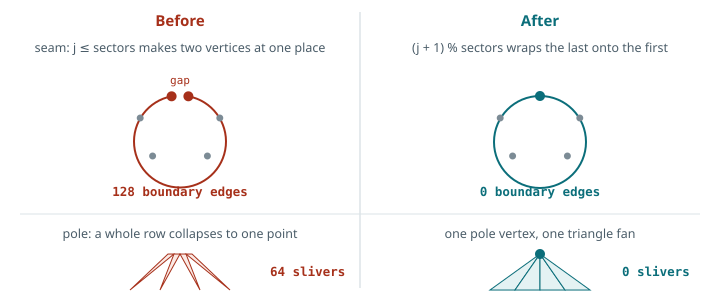
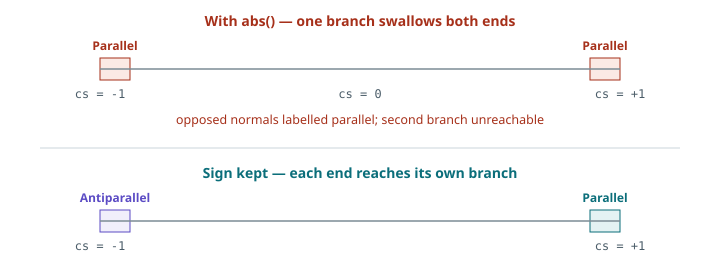
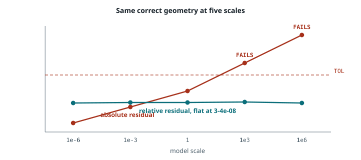

# Verification — what the evaluator guarantees

Companion to [Notes.md](Notes.md), which derives the patch. This file covers
correctness: what each test checks, why the mesh and solver are built the way
they are, and what the current measurements are.

Every later stage of this work makes decisions from numbers this code produces,
so the evaluator is validated before it is trusted. The test meshes are a sphere
and a torus because their normals come from a formula rather than an estimate,
which means the machinery can be proven against exact input.

---

## 1. Closed meshes: periodic indexing and pole fans



**The seam.** The angle `phi` runs from 0 to 2π, and those are the same place.
Generating a vertex at both ends produces two vertices that coincide
geometrically while remaining distinct topologically: the mesh looks closed and
is not. The generators therefore emit `j < sectors` vertices and wrap the index
with modulo arithmetic.

Welding duplicates afterwards is the obvious alternative and is worse. Comparing
float positions fails at 2π, where rounding leaves the coordinates not quite
equal, and every face index has to be remapped afterwards. Modulo indexing avoids
both problems by never creating the duplicate.

**The poles.** At `theta = 0` every value of `phi` gives the same point, so a
naive loop puts an entire row of vertices on one spot and the triangles in that
band have two coincident corners. The sphere generator emits interior rings only,
adds a single vertex per pole, and joins each with a triangle fan.

These are independent problems with independent solutions. Both present as
"duplicate vertices" but neither fix addresses the other.

**Winding.** Faces are wound so the geometric face normal agrees with the average
of its three vertex normals. This is checked explicitly, because the
normal-recovery test cannot see it: that test compares with `1 - |dot|`, and the
absolute value is deliberate — it verifies the patch normal lies along the same
*line* as the vertex normal, so it is blind to direction by design.

---

## 2. The curvature solve

### Normalization and clamping

`Curvature()` normalizes both normals on entry rather than trusting the caller,
and clamps the dot product to [-1, 1] before use. The clamp matters: rounding can
push the dot product of two unit vectors slightly outside the range, which would
make `1 - cs²` negative.

### Two singular cases, not one



Both ends of the cosine range return `c = 0`, and they mean opposite things:

| case | meaning | is zero the right answer? |
|---|---|---|
| `cs → +1` | normals are parallel; the edge is flat | **yes** |
| `cs → -1` | normals oppose; no valid quadratic exists | **no, it is a fabrication** |

They are therefore reported separately through a `CurvatureStatus` carried out
with the coefficients, so the production path can distinguish them and not only
the tests. A single guard on `|cs|` collapses the two cases together and makes a
fabricated patch indistinguishable from a legitimate flat one.

```cpp
if (cs >  1.0 - 1e-12) { /* Parallel     */ }
if (cs < -1.0 + 1e-12) { /* Antiparallel */ }
```

This is dormant on analytic sphere and torus normals, which never oppose across
an edge. It becomes relevant with normals estimated from real geometry, where
opposition can occur near sharp features.

### Third condition on the curvature vector

The two perpendicularity conditions give two equations for a three-component
vector. The remaining freedom is the component of **c** pointing out of the plane
of the two normals; dropping it, keeping the shortest **c** that still satisfies
the conditions, is what makes the system solvable. Derived in
[Notes.md](Notes.md) §3.1.

---

## 3. Scale independence



Three checks in this code compare a computed quantity against a threshold, and
all three are built as dimensionless ratios rather than absolute values.

The reason is visible in the orthogonality residual. `|n·(d−c)|` has units of
**length**, so comparing it against a fixed tolerance tests the model's size as
well as its correctness. Across five scales of the same correct geometry:

| scale | absolute residual | against a fixed tolerance | relative residual | implied angle |
|---:|---:|:--|---:|---:|
| ×1e-6 | 9.25e-14 | passes, uninformatively | 3.50e-08 | 2.0e-06° |
| ×1e-3 | 1.25e-10 | passes, uninformatively | 4.51e-08 | 2.6e-06° |
| ×1 | 1.22e-07 | passes | 4.38e-08 | 2.5e-06° |
| ×1e3 | 1.29e-04 | **fails** | 4.62e-08 | 2.6e-06° |
| ×1e6 | 9.04e-02 | **fails** | 3.25e-08 | 1.9e-06° |

Twelve orders of magnitude of swing on geometry that is identically correct. An
absolute threshold would reject large models and wave small ones through.

**Why the edge length is the right divisor.** The condition being tested is that
the edge curve leaves the vertex perpendicular to the normal — a statement about
direction, containing no length. But **d** and **c** are lengths, so the residual
comes out as the tangent magnitude multiplied by the sine of the angle by which
it misses perpendicular. Dividing by `|d|` removes the size and leaves
approximately that sine, which is the quantity the condition is actually about.

This follows the source material: Nagata (2010) forms the patch stability
criterion as a ratio against the edge vector precisely so that it remains
dimensionless and therefore constant regardless of geometric scale.

The same reasoning applies to the degenerate-triangle test, which compares area
against the triangle's own longest edge squared. That makes it a test of shape
rather than of size, so a mesh and the same mesh scaled by a thousand classify
identically.

> A useful distinction: **relative for "is the mathematics right", absolute for
> "is the shape close enough".** A residual is a correctness assertion about the
> solver and must be scale-free. An error budget in model units is a physical
> tolerance and must not be.

---

## 4. One definition of a degenerate triangle

`IsDegenerate` is called by the error measurement and by every OBJ writer, so
measurement and export cannot disagree about which triangles exist. Without a
shared predicate, an exported error map describes a slightly different mesh than
the error figures do.

---

## 5. What each test covers

| Test | Scope | Question answered |
|---|---|---|
| 1 · Orthogonality | one hand-built triangle | is the curvature solve correct in isolation? |
| 2 · Vertex recovery | one patch | does the patch pass through its corners? |
| 3 · Normal recovery | one patch | does it reproduce the corner normals? |
| 4 · Convergence | sweep across resolutions | how fast does error shrink as the mesh refines? |
| 5 · Residual sweep | every edge of a mesh | does the solve hold across real geometry? |
| 6 · Topology | whole mesh | is this closed, manifold, correctly wound? |

Tests 1 and 5 check the same condition at different scopes, deliberately. Test 1
touches no mesh generator, so if it passes while test 5 fails, the fault is in
mesh construction rather than in the solver. That separation is what makes a
failure locatable instead of merely visible.

### Reading the instruments

- **Euler characteristic** `V − E + F` — a topological invariant: 2 for
  sphere-like surfaces, 0 for torus-like, independent of mesh density. If it is
  wrong, the mesh is not the object it claims to be.
- **Orthogonality residual** — a correctness assertion, not an accuracy
  measurement. A nonzero value means a bug or contradictory input, not an
  imprecise surface.
- **Stability ratio ‖c‖/‖d‖** — a different question from the residual: not "is
  the answer correct" but "is it alarmingly large". An edge can satisfy the
  residual exactly and still carry a curvature vector big enough to bulge the
  patch. Compared against a value near one, not against an epsilon.
- **Convergence order** — 4× per refinement is h², 16× is h⁴. This is the
  checkable claim, unlike a single improvement ratio, which depends entirely on
  the resolution at which it was taken.

---

## 6. Current measurements

```
Sphere 32×32   V=994  E=2976  F=1984   chi=2   boundary 0  degenerate 0  inward 0
Torus  20×10   V=200  E=600   F=400    chi=0   boundary 0  degenerate 0  inward 0

Residual sweep   sphere  1.25e-08  over 5952 edges
                 torus   4.38e-08  over 1200 edges

8/8 tests passing
```

### Convergence

| Surface | Flat, per refinement | Nagata, per refinement | Order |
|---|---|---|---|
| Sphere | 3.96 – 3.99 | 15.2 – 15.9 | h² and h⁴ |
| Torus | 3.92 – 3.98 | 8.1 – 9.5 | h² and h³ |

The two surfaces converge at different Nagata orders. Nagata (2010) tests a
sphere, cone, cylinder and torus and reports the order varying between 2.2 and 4
depending on surface type, attributing part of the variation to isolated singular
points such as apexes and saddles, and noting that a theoretical estimate is
difficult because the algorithm involves a generalized inverse whose definition
changes with the rank of the matrix. Morita et al. (2010) measured order 3.08 for
the Nagata patch on an aspheric lens.

The sphere is the favourable case, being a quadratic surface of constant
curvature. **Order 3 is the more representative expectation on general geometry.**

### Precision

`pi` is declared `double` but initialised from a float literal, which limits
residuals to roughly 1e-09 — four orders under tolerance, and not a constraint on
any measurement reported here.

---

## References

- T. Nagata, *Simple local interpolation of surfaces using normal vectors*,
  Computer Aided Geometric Design 22(4), 2005 — the C0 patch.
- T. Nagata, *Smooth local interpolation of surfaces using normal vectors*,
  Journal of Applied Mathematics, 2010 — the G1 extension, the dimensionless
  stability criterion, and convergence order by surface type.
- S. Morita, Y. Nishidate, T. Nagata, Y. Yamagata, C. Teodosiu, *Ray-tracing
  simulation method using piecewise quadratic interpolant for aspheric optical
  systems*, Applied Optics 49(18), 2010 — measured convergence orders 2.02
  (linear) and 3.08 (Nagata).