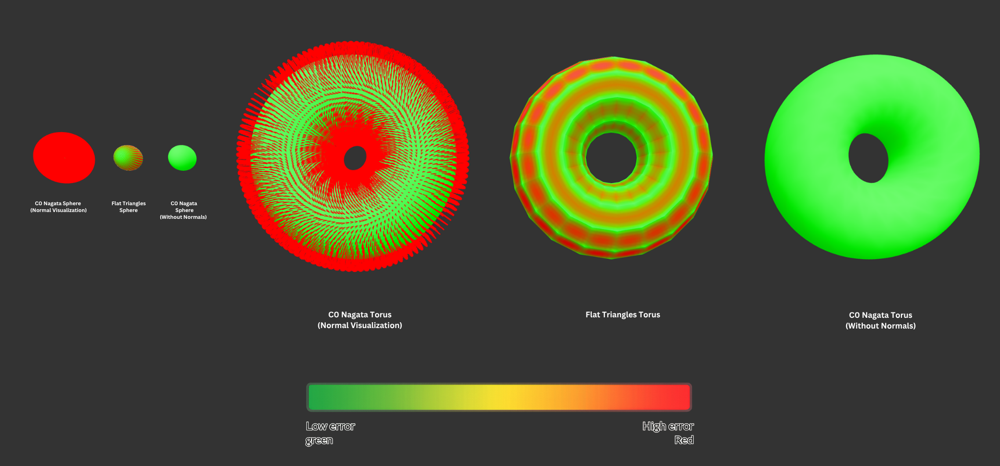

# C0 Nagata Patch Evaluator

Reconstructing smooth curved surfaces from a triangle mesh using **C0 Nagata patches** (Nagata, 2005): each triangle's three vertices and their three normals define a quadratic patch that curves to follow the surface. This project implements the patch evaluator, verifies it against analytic surfaces (sphere and torus), and quantifies how much more accurately Nagata patches approximate a curved surface than flat triangles at the same mesh resolution.

## Documentation

**[Docs/Notes.md](Docs/Notes.md)** is the full write-up behind this code: the motivation, the derivation of the patch coefficients from first principles, the verification tests, the error metrics for the sphere and torus, the resolution experiment, and the findings and known limitations.

**[Docs/Verification.md](Docs/Verification.md)** covers correctness: what each test checks, why the mesh and solver are built the way they are, and the current measurements.

## Headline result

Error against the true surface, measured as the maximum distance from the analytic shape, across mesh resolutions. Both methods use the same control mesh and the same sampling; only flat-vs-curved differs.

**Sphere (radius 1):**

| Triangles | Flat max error | Nagata max error |
|----------:|---------------:|-----------------:|
|        24 | 0.3210         |          0.06066 |
|       112 | 0.09121        |         0.004534 |
|       480 | 0.02375        |        0.0002890 |
|      1984 | 0.006002       |       0.00001816 |
|      8064 | 0.001505       |      0.000001164 |

Flat-triangle error falls about 4x per resolution doubling (order h²); on this surface Nagata error falls about 16x (order h⁴). **Nagata at 112 triangles (0.0045) is already more accurate than flat triangles at 1984 (0.0060): roughly 16x fewer control-mesh triangles for the same accuracy, and the gap widens as the mesh refines.**

**Torus (centerline radius 5, tube radius 3):**

| Triangles | Flat max error | Nagata max error |
|----------:|---------------:|-----------------:|
| 32        | 2.460          | 0.4853           |
| 128       | 0.7652         | 0.05102          |
| 512       | 0.2063         | 0.005941         |
| 2048      | 0.05264        | 0.0007186        |
| 8192      | 0.01323        | 0.00008845       |

The absolute numbers are larger because the torus is a bigger shape (radii 5 and 3, not a unit surface). The convergence behaviour also differs: flat error falls about 4x per doubling (order h^2), while Nagata error falls about 8x rather than 16x, which is order h^3.

Convergence order for these patches depends on the surface. Nagata (2010) tests a sphere, cone, cylinder and torus and reports orders between 2.2 and 4; Morita et al. (2010) measured 3.08 on an aspheric lens. The sphere is the favourable case, being a quadratic surface of constant curvature, so order 3 is the more representative expectation on general geometry.

## Visual comparison



Green means on the true surface, red means far from it, scaled so that the flat mesh's worst error maps to full red. Flat triangles (the faceted, red-blotched shapes) sag away from the surface between vertices; Nagata patches (uniformly green) stay on it. The spiky renders show the per-vertex surface normals the patches reconstruct.

## Build and run

```powershell
cmake -S . -B cmake-build-debug
cmake --build cmake-build-debug --config Debug
.\cmake-build-debug\Debug\C0Eval.exe
```

Running the program:
1. Runs eight correctness tests covering a single patch, mesh topology, and a residual sweep across every edge.
2. Prints flat-vs-Nagata max error across resolutions for a sphere and a torus.
3. Writes four error-colored OBJ files (sphere and torus, flat and Nagata) to the working directory.

Open the colored OBJ files in a viewer that reads per-vertex color (for example [3dviewer.net](https://3dviewer.net), [the three.js editor](https://threejs.org/editor/), or Blender with Solid shading then Color set to Attribute). For the smooth-normal view, use the Nagata sphere with Shade Smooth.

## What is implemented

- C0 Nagata patch evaluation: surface point and surface normal at any parameter `(eta, zeta)`.
- Eight correctness tests: curvature orthogonality, vertex recovery, normal recovery, convergence across resolutions, an orthogonality residual sweep over every edge of a mesh, and topological validation (Euler characteristic, boundary edges, manifoldness, degenerate triangles, winding) on the sphere and the torus.
- A shape-independent error metric (passed in as a function), so the same code measures both the sphere and the torus.
- Flat-vs-Nagata error comparison across mesh resolutions.
- Error-colored OBJ export, with reconstructed normals on the Nagata meshes.

## Verification

All eight tests pass on the sphere and the torus.

<details>
<summary>Full program output</summary>

```
 Test 1: Orthogonality check
  v0->v1:  |n_s.(d-c)|/|d|=0  |n_e.(d+c)|/|d|=0  OK
  v1->v2:  |n_s.(d-c)|/|d|=0  |n_e.(d+c)|/|d|=0  OK
  v0->v2:  |n_s.(d-c)|/|d|=0  |n_e.(d+c)|/|d|=0  OK

Test 2: Vertex recovery
  v0 (0,0):  error=0  PASS
  v1 (0,1):  error=0  PASS
  v2 (1,1):  error=0  PASS

Test 3: Normal recovery at vertices
  n0 (0,0):  |1-|dot||=0  PASS
  n1 (0,1):  |1-|dot||=0  PASS
  n2 (1,1):  |1-|dot||=0  PASS

Test 4: Mesh accuracy  (1984 triangles, 20 samples across the whole triangle's parameter grid)
Samples:           458304
Max flat error:    0.00600242
Max Nagata error:  1.81583e-05
Avg flat error:    0.00233273
Avg Nagata error:  2.49727e-06
Ratio at this resolution: 330.561x
  Nagata < flat?     PASS

Test 5: Orthogonality residual sweep  (sphere 32x32)
  edges checked        5952
  worst |n0.(d-c)|/|d| 1.25246e-08
  worst |n1.(d+c)|/|d| 1.25246e-08
  flat edges (skipped) 0
  opposed normals      0
  edges over tolerance 0  PASS

Test 5: Orthogonality residual sweep  (torus 20x10)
  edges checked        1200
  worst |n0.(d-c)|/|d| 4.38423e-08
  worst |n1.(d+c)|/|d| 4.38423e-08
  flat edges (skipped) 0
  opposed normals      0
  edges over tolerance 0  PASS

Test 6: Topology  (sphere 32x32)
  V=994  E=2976  F=1984
  Euler characteristic 2  (expected 2)  PASS
  boundary edges       0  PASS
  non-manifold edges   0  PASS
  degenerate triangles 0  PASS
  inward-wound faces   0  PASS

Test 6: Topology  (torus 20x10)
  V=200  E=600  F=400
  Euler characteristic 0  (expected 0)  PASS
  boundary edges       0  PASS
  non-manifold edges   0  PASS
  degenerate triangles 0  PASS
  inward-wound faces   0  PASS

Results: 8/8 tests passed

Sphere:
+-------+----------+--------------+--------------+----------+----------+-----------+
|   res |     tris |      maxFlat |    maxNagata |   flat/x |    nag/x |     ratio |
+-------+----------+--------------+--------------+----------+----------+-----------+
|     4 |       24 |    3.210e-01 |    6.066e-02 |        - |        - |      5.3x |
|     8 |      112 |    9.121e-02 |    4.534e-03 |     3.52 |    13.38 |     20.1x |
|    16 |      480 |    2.375e-02 |    2.889e-04 |     3.84 |    15.69 |     82.2x |
|    32 |     1984 |    6.002e-03 |    1.816e-05 |     3.96 |    15.91 |    330.6x |
|    64 |     8064 |    1.505e-03 |    1.164e-06 |     3.99 |    15.60 |   1292.6x |
+-------+----------+--------------+--------------+----------+----------+-----------+

Torus:
+-------+----------+--------------+--------------+----------+----------+-----------+
|   res |     tris |      maxFlat |    maxNagata |   flat/x |    nag/x |     ratio |
+-------+----------+--------------+--------------+----------+----------+-----------+
|     4 |       32 |    2.460e+00 |    4.853e-01 |        - |        - |      5.1x |
|     8 |      128 |    7.652e-01 |    5.102e-02 |     3.22 |     9.51 |     15.0x |
|    16 |      512 |    2.063e-01 |    5.941e-03 |     3.71 |     8.59 |     34.7x |
|    32 |     2048 |    5.264e-02 |    7.186e-04 |     3.92 |     8.27 |     73.3x |
|    64 |     8192 |    1.323e-02 |    8.840e-05 |     3.98 |     8.13 |    149.7x |
+-------+----------+--------------+--------------+----------+----------+-----------+


```
A single improvement ratio describes one row of the table rather than the method: it multiplies by about four with every refinement, from 5x at the coarsest resolution to over 1200x at the finest. The convergence orders are the checkable claim, which is why the sweep prints per-refinement drop factors.
</details>

## Project layout

- `Core/` — evaluator (`Evaluator.cpp`, `Evaluator.h`) and entry point (`Main.cpp`)
- `Tests/` — the correctness and validation tests
- `Utils/` — vector math, mesh structs, sphere and torus mesh generators, error-stats struct
- `Docs/`: [Notes.md](Docs/Notes.md) (full derivation and findings), plus the figures used in this README

## Scope and notes

This implements the **C0** patch only (position-continuous across shared edges). The G1 extension (tangent-plane continuity) is not implemented; C0 was the requested scope and is the foundation G1 builds on. See [Docs/Notes.md](Docs/Notes.md) for the coefficient derivation, the C0-vs-G1 distinction, a sign discrepancy found between the source papers, and known limitations.

## Reference

T. Nagata, "Simple local interpolation of surfaces using normal vectors,"
*Computer Aided Geometric Design*, 2005.

Y. Nishidate et al., "Ray-tracing method for isotropic inhomogeneous
refractive-index media from arbitrary discrete input." (This paper's form of the
$\mathbf{c}_{11}$ coefficient matches the sign derived here.)

K. Morita et al., "Ray-tracing simulation method using piecewise quadratic
interpolant for aspheric optical systems," *Applied Optics*, 2010.